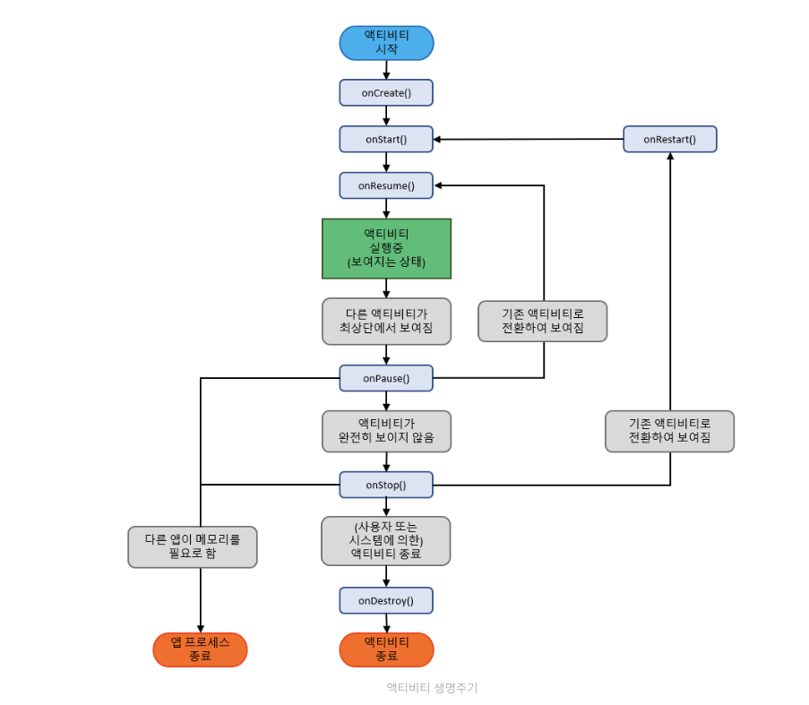

first commit

# 1.) 안드로이드 UI

## 1. manifests

- 안드로이드 앱의 지도역할을 한다.
- 어떠한 화면, 어떤 역할을 하는지 알 수 있게 도와 준다.

  ```code
      <?xml version="1.0" encoding="utf-8"?>
      <manifest xmlns:android="http://schemas.android.com/apk/res/android"
      package="com.geoniljang.androidui"> // 고유한 패키지명 앱의 이름을 적어 주게된다.

      <application // 앱에 대한 내용을 적어 주는 곳
      android:allowBackup="true" // 앱 삭제 후 재설치 했을때 그 앱의 설정 값을 기억 할 수 있도록 하는 옵션 입니다.

      android:icon="@mipmap/ic_launcher" // 앱을 다운로드 했을 때 화면에 보여지는 앱의 아이콘
      android:label="@string/app_name" //앱 이름
      android:roundIcon="@mipmap/ic_launcher_round" // @(경로를 나타내는 키워드) res 파일에 있다.
      android:supportsRtl="true" // 글을 읽는 방향
      android:theme="@style/AppTheme"> // 앱의 테마를 기본값으로 사용하고 있다는 의미를 가진다.

      //Activity는 보여지는 화면을 의미한다.
      <activity android:name=".MainActivity"> //package 아래 있는 MainActivity의 이름

      <intent-filter>
      <action android:name="android.intent.action.MAIN" />
      <category android:name="android.intent.category.LAUNCHER" /> // 이 속성은 이 액티비티를 런처 액티비티로 만들어 준다는 의미이며, 화면을 켜면 제일 먼저 보여지는 화면을 설정하는 부분이 된다.
      </intent-filter>
      </activity>
      </application>
      </manifest>
  ```

## 2. java 폴더

- 3개의 폴더가 자동으로 생기나 앱을 개발할 떄는 메인엑티비티가 있는 패키지만을 사용한다.
- java(generated) 파일은 건들지 말자.

## 3. res (리소스) 폴더

- drawable : 이미지
- layout : 화면을 그릴때 사용하는 xml의 모음
- mipmap : 앱의 아이콘
- values : 값들을 저장해 두는 목적으로 사용한다. 앱 전역에서 사용하고자 하는 값을 저장해둔다.

## 4. Gradle Script

0.  Gradle : 라이브러리 관리를 한다. and 컴파일을 도와준다.
1.  project

    - 프로젝트안에는 여러가지 앱이 존재할 수 있다.
    - 앱 전제에 적용하기 위함

      ```code
      buildscript {
          ext.kotlin_version = '1.3.61' // 코틀린의 버전을 알려준다.

          repositories { // 외부 라이브러리에서 가져온다.
              google()
              jcenter()
          }

          dependencies { // 의존성 : 우리 프로젝트가 만들어 질때 아래 적혀있는 것들을 사용한다.
              classpath 'com.android.tools.build:gradle:3.5.3' // 그레이들의 버전을 말한다.
              classpath "org.jetbrains.kotlin:kotlin-gradle-plugin:$kotlin_version"
          }
      }

      allprojects {
          repositories {
              google()
              jcenter()

          }
      }

      task clean(type: Delete) {
          delete rootProject.buildDir
      }
      ```

1.  module

    - 특정앱에만 적용하기 위함

      ```code
      apply plugin: 'com.android.application'
      apply plugin: 'kotlin-android'
      apply plugin: 'kotlin-android-extensions'

      android {
          compileSdkVersion 29 // 프로젝트 만들때 API 버전 29 기준으로 만들겠다.
          buildToolsVersion "29.0.3" // 작성한 언어를 빌드하는 버전
          defaultConfig {
              applicationId "com.geoniljang.androidui" // 패키지명 고유한 값이어야한다.
              minSdkVersion 21 // 최소한의 설치 가능 기종
              targetSdkVersion 29 //
              versionCode 1 // 앱을 업데이트하면 올라가는 갓
              versionName "1.0" // 버전의 숫자
              testInstrumentationRunner "androidx.test.runner.AndroidJUnitRunner" // 테스트 코드를 돌릴 수 있는 예를 적어 두는 곳
          }
          buildTypes {
              release { // 배포할 목표로 빌드한다.
                  minifyEnabled false
                  proguardFiles getDefaultProguardFile('proguard-android-optimize.txt'), 'proguard-rules.pro'
              }
          }
      }

      dependencies { // 프로젝트 안에 있는 앱의 의존성 아래 있는 것들에 도움을 받고 있다고 할 수 있습니다.
          implementation fileTree(dir: 'libs', include: ['*.jar'])
          implementation"org.jetbrains.kotlin:kotlin-stdlib-jdk7:\$kotlin_version"
          implementation 'androidx.appcompat:appcompat:1.0.2'
          implementation 'androidx.core:core-ktx:1.0.2'
          implementation 'androidx.constraintlayout:constraintlayout:1.1.3'
          testImplementation 'junit:junit:4.12'
          androidTestImplementation 'androidx.test.ext:junit:1.1.0'
          androidTestImplementation 'androidx.test.espresso:espresso-core:3.1.1'
      }
      ```

1.  properties : 건들 필요 없다.
1.  proguard : 외부로 노출 하지 않기위해 난독화 작업을 도와 준다.
1.  settings : 거의 수정할 내용이 없다.
1.  local : 거의 수정할 내용이 없다.

## 6. 안드로이드 스튜디오 사용법

1. Activity
   - 앱의 한 화면이 된다.
   - Life Cycle (수명 주기)
     
